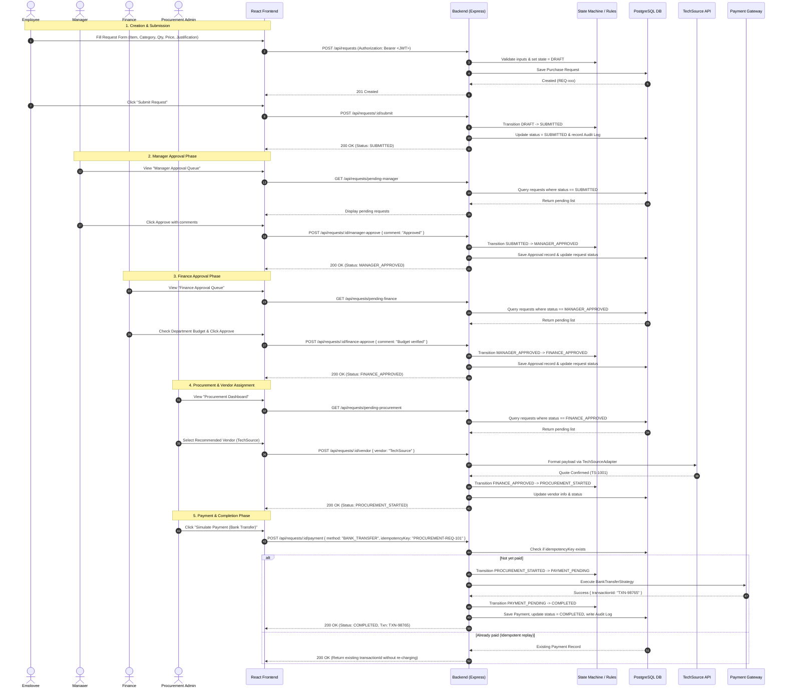

# Workflow Diagram: Procurement & Approval Platform

## End-to-End MVP Workflow

## State Machine Transition Rules

| Current Status | Action | Allowed Role | Next Status | Business Rule / Validation |
|---|---|---|---|---|
| `DRAFT` | Submit | `EMPLOYEE` | `SUBMITTED` | All required fields present, qty > 0, price > 0 |
| `DRAFT` | Cancel | `EMPLOYEE` | `CANCELLED` | Request is terminated |
| `SUBMITTED` | Cancel | `EMPLOYEE` | `CANCELLED` | Cancellation allowed before manager takes action |
| `SUBMITTED` | Approve | `MANAGER` | `MANAGER_APPROVED` | Manager belongs to org / team |
| `SUBMITTED` | Reject | `MANAGER` | `REJECTED` | Mandatory rejection comment |
| `MANAGER_APPROVED` | Approve | `FINANCE` | `FINANCE_APPROVED` | Department budget validated |
| `MANAGER_APPROVED` | Reject | `FINANCE` | `REJECTED` | Mandatory rejection comment |
| `FINANCE_APPROVED` | Assign Vendor | `PROCUREMENT_ADMIN` | `PROCUREMENT_STARTED` | Vendor selected (TechSource in MVP) |
| `PROCUREMENT_STARTED` | Pay | `PROCUREMENT_ADMIN` | `PAYMENT_PENDING` $\rightarrow$ `COMPLETED` | Valid payment strategy & idempotency key |
| `REJECTED` | Edit & Resubmit | `EMPLOYEE` | `DRAFT` or `SUBMITTED` | Request can be revived by author |
